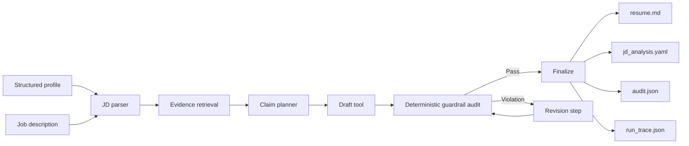

# Evidence-grounded Resume Tailoring Agent

[](https://github.com/JosieCen/Evidence-grounded_Resume_Tailoring_Agent/actions/workflows/ci.yml)

A privacy-safe AI-agent showcase for **tailoring resume content to a job description without inventing experience**.

The project treats resume tailoring as an evidence-grounding problem rather than a free-form generation problem. Every resume bullet must trace back to a verified structured claim; unsupported requirements remain explicit gaps; deterministic guardrails can reject and revise unsafe draft content before finalization.

> **Public-showcase boundary:** every person, organization, job description, metric and artifact in this repository is fictional. No private application data or real contact information is included.

## Why this project exists

Generic LLM resume rewriting is useful but risky:

- it can silently fabricate responsibilities or outcomes;
- it can turn a partial match into an apparent strong match;
- numbers may lose their evidence source during rewriting;
- multiple tailored versions can drift away from the same factual profile;
- a polished answer can hide unresolved gaps.

This project asks a narrower product question:

> **How can an agent tailor application content while preserving claim-level provenance and refusing unsupported claims?**

## Agent workflow



The controller is agentic, but safety-critical checks are deliberately deterministic. The current showcase uses a lightweight local matcher so the demo runs without an API key; the retrieval/reasoning layer is designed to be replaceable by an LLM or embedding service without changing the evidence and audit contracts.

## Core design decisions

| Decision | Rationale |
| --- | --- |
| Structured claims as the source of truth | Generated text should not become a new factual database. |
| Claim-level `evidence_refs` | Every visible bullet can be audited back to a source record. |
| `verified`, `visible`, and `do_not_claim` gates | Some facts may exist but still be unsuitable for public or resume use. |
| GAP stays GAP | The agent is not allowed to solve a JD mismatch by inventing experience. |
| Numeric traceability | A number is only allowed when the source claim owns the corresponding metric. |
| Deterministic final audit | Semantic generation and factual authorization are different tasks. |
| Explicit run trace | Recruiters and developers can inspect what the agent did at each step. |

## Quick start

```bash
python -m venv .venv
# Windows: .venv\Scripts\activate
# macOS/Linux: source .venv/bin/activate

pip install -e ".[dev]"

resume-agent run \
  --profile examples/fictional_profile.yaml \
  --jd examples/fictional_jd.md \
  --output outputs/demo
```

Generated artifacts:

```text
outputs/demo/
├── jd_analysis.yaml   # requirement → evidence map + explicit gaps
├── resume.md          # tailored, evidence-authorized output
├── audit.json         # pass/fail + traceability metadata
└── run_trace.json     # tool/decision trace
```

A committed example is available in [`examples/generated_demo`](examples/generated_demo).

## Demonstrate the audit/revision loop

The following command intentionally injects one unsupported claim into the draft:

```bash
resume-agent run \
  --profile examples/fictional_profile.yaml \
  --jd examples/fictional_jd.md \
  --output outputs/unsafe_demo \
  --simulate-unsafe-draft
```

The audit detects the unsupported bullet, the agent removes it, re-audits the draft and only then finalizes. The baseline demo completed with **1 revision and 0 remaining violations**. See [`examples/generated_unsafe_demo`](examples/generated_unsafe_demo).

## Evaluation

```bash
resume-agent evaluate \
  --profile examples/fictional_profile.yaml \
  --output outputs/evaluation.json
```

Current baseline on the committed fictional fixture:

- **7/7 synthetic guardrail cases passed**;
- unsupported source → blocked;
- unknown source → blocked;
- unverified claim → blocked;
- hidden claim → blocked;
- forbidden wording → blocked;
- untraceable number → blocked;
- verified, traceable claim → allowed;
- the E2E demo preserves **1 explicit JD gap** instead of fabricating a match;
- automated test suite: **7 tests passed** at the current baseline.

See [`docs/EVALUATION.md`](docs/EVALUATION.md) and [`examples/evaluation_baseline.json`](examples/evaluation_baseline.json).

## Streamlit demo

```bash
pip install -e ".[ui]"
streamlit run app.py
```

The UI lets a reviewer edit the fictional JD, run the agent, inspect the requirement-to-evidence map, view the tailored output and inspect the audit report.

## Repository structure

```text
Evidence-grounded_Resume_Tailoring_Agent/
├── src/evidence_grounded_resume_agent/
│   ├── agent.py          # controller + audit/revision loop
│   ├── tools.py          # JD parsing, retrieval, planning, drafting
│   ├── guardrails.py     # deterministic factual safety checks
│   ├── profile.py        # structured evidence model
│   ├── render.py         # output rendering
│   ├── evaluation.py     # synthetic guardrail evaluation
│   └── cli.py
├── examples/
│   ├── fictional_profile.yaml
│   ├── fictional_jd.md
│   ├── generated_demo/
│   ├── generated_unsafe_demo/
│   └── evaluation_baseline.json
├── tests/
├── docs/
├── app.py
└── .github/workflows/ci.yml
```

## CARR case-study summary

### Context

Resume tailoring with generative AI creates a trust problem: job-specific optimization is useful, but unsupported experience, numerical drift and version inconsistency can make the output unreliable.

### Action

I reframed the task as an evidence-grounded agent workflow. I separated semantic matching from factual authorization, represented career evidence as verified structured claims, added claim-level provenance, implemented explicit JD gaps, and built an audit/revision loop for unsupported sources, hidden or unverified facts, forbidden wording and untraceable metrics.

### Results

Built a runnable CLI and optional Streamlit prototype with reproducible outputs, an inspectable decision trace, GitHub Actions CI, 7 automated tests, and a 7-case synthetic guardrail suite with a 100% baseline pass rate. The demo also preserves an intentionally unsupported enterprise-deployment/revenue requirement as a gap and automatically removes an injected unsafe draft claim before finalization.

### Reflection

The current local matcher is intentionally simple and is not a substitute for production semantic retrieval. The next iteration would introduce an LLM/embedding retrieval layer, benchmark semantic match quality separately from factual safety, add user-controlled rewrite style, and test whether stronger tailoring improves relevance without increasing unsupported-claim rate.

Full version: [`docs/CARR.md`](docs/CARR.md).

## What this project demonstrates

**AI Product:** problem framing, workflow design, human/AI responsibility boundaries, failure modes, evaluation design and iteration strategy.

**Agent Engineering:** tool orchestration, stateful control loop, replaceable reasoning layer, deterministic guardrails, traceability and CI.

**Responsible AI:** grounding, provenance, explicit uncertainty/gaps, privacy-safe fixtures and anti-hallucination design.

## Limitations

This is a portfolio-grade prototype, not a production recruiting platform. It does not claim that lexical matching is sufficient for real candidate-role fit, does not rank candidates, and does not infer protected attributes. The public repository intentionally excludes real personal data and real application histories.

## Roadmap

- [ ] Add an optional LLM/embedding semantic retriever behind a provider interface.
- [ ] Benchmark requirement-level precision/recall on a larger synthetic fixture set.
- [ ] Add controlled paraphrasing while retaining source-claim IDs.
- [ ] Add recruiter-facing relevance scoring separated from factual safety scoring.
- [ ] Add export adapters for JSON/Markdown and a presentation-ready portfolio view.

## License

MIT.
