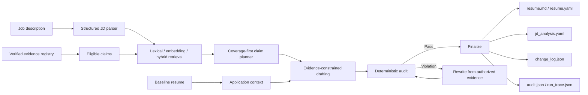

# Evidence-grounded Resume Tailoring Agent

[](https://github.com/JosieCen/Evidence-grounded_Resume_Tailoring_Agent/actions/workflows/ci.yml)
[](https://github.com/JosieCen/Evidence-grounded_Resume_Tailoring_Agent/actions/workflows/semantic-benchmark.yml)

A privacy-safe portfolio project for **tailoring resume content to a job description without inventing experience**.

**v0.3 moves the project from evidence retrieval + filtering toward an actual tailoring workflow:** it adds structured JD analysis with stable requirement IDs, multilingual semantic retrieval, evidence-constrained rewriting, evidence-based revision, a baseline-to-application change log, a verified evidence registry, and a 72-case labeled benchmark.

> **Public-showcase boundary:** every person, organization, job description, metric, evidence record, and artifact in this repository is fictional. No private resume or application data is included.

## Product question

Generic LLM resume rewriting can make a resume sound relevant while quietly changing facts. Keyword matching has the opposite failure mode: it can preserve facts but miss transferable experience when the JD uses different language.

> **How can a tailoring agent recover semantically relevant evidence, rewrite only within authorized factual boundaries, keep gaps visible, and make every change auditable?**

## v0.3 workflow



Semantic similarity can **propose** evidence. It cannot override `verified`, `visible`, evidence-registry, metric-ownership, or `do_not_claim` rules.

## What changed in v0.3

| Area | v0.2 | v0.3 |
| --- | --- | --- |
| JD parsing | One requirement per non-empty line; sequential IDs | Structured responsibility / must-have / nice-to-have classification with content-stable IDs |
| Retrieval | English-first lexical / embedding / hybrid | Multilingual default embedding model + weighted lexical scoring + explicit unsupported-scope gate |
| Drafting | Claim text copied directly into output | JD-aware selection among evidence-authorized wording variants |
| Revision | Invalid bullets removed | Sourced bullets are rewritten from authorized evidence, then re-audited; only unrecoverable bullets are dropped |
| Provenance | Claim-level `evidence_refs` strings | Evidence registry + claim provenance + metric ownership |
| Workflow | JD → generated resume | Baseline resume + JD → tailored application + before/after change log |
| Benchmark | 6 cases | **72 cases** across semantic, bilingual, numeric, overclaim, seniority, and explicit-gap scenarios |
| Evaluation | Aggregate retrieval metrics | Positive retrieval, explicit-gap false positives, forbidden-top1 rate, overall accuracy, and per-category metrics |

## 72-case retrieval benchmark

The public fixture contains **72 labeled cases**: **48 supported requirements**, **24 explicit gaps / hard negatives**, and **24 Chinese-language cases**. It covers 12 lexical controls, 12 semantic-transfer cases, 12 bilingual Chinese cases, 7 transferable-capability cases, 5 numeric-provenance cases, 8 explicit gaps, 8 overclaim traps, and 8 seniority hard negatives.

The lexical baseline on the committed v0.3 fixture is:

| Retriever | Positive Top-1 | Recall@3 | Gap accuracy | Overall case accuracy |
| --- | ---: | ---: | ---: | ---: |
| Lexical | **83.3%** | **100%** | **100%** | **88.9%** |
| Embedding | Generated in GitHub Actions | Generated in GitHub Actions | Generated in GitHub Actions | Generated in GitHub Actions |
| Hybrid | Generated in GitHub Actions | Generated in GitHub Actions | Generated in GitHub Actions | Generated in GitHub Actions |

The Semantic Retrieval Benchmark workflow runs the multilingual embedding and hybrid variants with a real Sentence Transformers model and uploads machine-readable reports. Aggregate values are committed in `examples/retrieval_baseline_summary.json` when refreshed. These are retrieval/safety fixture metrics, **not ATS scores or hiring outcomes**.

## Benchmark categories

Positive retrieval covers `lexical_control`, `semantic_transfer`, `bilingual_zh`, `transferable_capability`, and `numeric_provenance`. Negative/scope-safety cases cover `explicit_gap`, `overclaim_trap`, and `seniority_hard_negative`.

`do_not_claim` also exists at the profile level. Known unsupported scopes are rejected **before similarity ranking**, so a highly similar but unauthorized claim cannot turn a known gap into a match.

## Structured JD analysis

Requirement IDs are content-stable hashes rather than `req_01`, `req_02`, etc. Adding an unrelated JD line therefore does not renumber existing requirements. Supported types are `responsibility`, `must_have`, and `nice_to_have`, each with priority metadata.

```yaml
id: req_a7c5bfc712
text: Use data analysis to identify patterns and turn findings into actionable insights.
kind: must_have
priority: high
match_level: STRONG_MATCH
source_claim_ids:
  - claim_data_analysis_4800
```

## Evidence-constrained tailoring

The default generator does **not** free-write new factual propositions. Each claim can expose canonical verified text, evidence-preserving paraphrases, source evidence IDs, owned metrics, and `do_not_claim` boundaries. The agent selects the wording variant that best fits the matched JD requirement while keeping the same provenance attached.

This is intentionally conservative. The generator interface can later be replaced by an LLM, but any future generator still sits upstream of the same deterministic authorization layer.

## Real revision instead of delete-only filtering

The unsafe demo mutates a **sourced** bullet into unsupported ownership/revenue wording. The audit catches the forbidden scope and untraceable `42%`; revision then reconstructs the bullet from its authorized source claim and re-runs the audit. Only a bullet with no recoverable authorized source is removed.

```text
unsafe sourced draft
        ↓
forbidden phrase + untraceable number
        ↓
rewrite from verified claim/paraphrase pool
        ↓
re-audit
        ↓
pass
```

## Baseline → application workflow

The public demo includes a fictional baseline resume. A run starts from that baseline and produces a tailored resume plus `change_log.json`. Changes are labeled `unchanged`, `rephrased`, `added`, or `not_selected`, avoiding the unrealistic pattern of recreating the candidate from scratch for every application.

## Quick start

```bash
python -m venv .venv
# Windows: .venv\Scripts\activate
# macOS/Linux: source .venv/bin/activate
pip install -e ".[dev]"

resume-agent run \
  --profile examples/fictional_profile.yaml \
  --jd examples/fictional_jd.md \
  --baseline examples/fictional_baseline_resume.yaml \
  --output outputs/demo \
  --retriever lexical
```

Generated artifacts:

```text
outputs/demo/
├── jd_analysis.yaml
├── resume.yaml
├── resume.md
├── change_log.json
├── audit.json
└── run_trace.json
```

## Semantic / hybrid retrieval

```bash
pip install -e ".[dev,embedding]"
resume-agent run \
  --profile examples/fictional_profile.yaml \
  --jd examples/fictional_jd.md \
  --baseline examples/fictional_baseline_resume.yaml \
  --output outputs/hybrid_demo \
  --retriever hybrid
```

The default semantic model in v0.3 is `sentence-transformers/paraphrase-multilingual-MiniLM-L12-v2`, matching the public benchmark's English/Chinese application scenario more closely than the previous English-focused default.

## Retrieval benchmark

```bash
resume-agent benchmark-retrieval \
  --profile examples/fictional_profile.yaml \
  --benchmark examples/retrieval_benchmark.yaml \
  --retriever lexical \
  --output outputs/lexical_benchmark.json
```

Reports include positive Top-1 accuracy, Recall@3, explicit-gap accuracy, false-positive rate on gap cases, forbidden-top1 rate, overall case accuracy, per-category metrics, and per-case observed claim IDs/scores.

## Guardrail evaluation

```bash
resume-agent evaluate \
  --profile examples/fictional_profile.yaml \
  --output outputs/evaluation.json
```

v0.3 CI verifies missing/unknown sources, unverified/hidden claims, evidence-registry resolution, forbidden wording, number/metric ownership including valid multi-source unions, unsupported-scope gaps, rewrite-based recovery, stable JD IDs, and minimum benchmark size/category coverage.

## Streamlit demo

```bash
pip install -e ".[ui]"
streamlit run app.py
```

For embedding/hybrid mode use `pip install -e ".[ui,embedding]"`. The UI shows requirement type/priority, match scores, source IDs, unsupported-scope notes, tailored output, before/after changes, safety audit, and full run trace.

## Repository structure

```text
Evidence-grounded_Resume_Tailoring_Agent/
├── src/evidence_grounded_resume_agent/
│   ├── agent.py
│   ├── application.py
│   ├── generation.py
│   ├── guardrails.py
│   ├── jd.py
│   ├── retrieval.py
│   ├── retrieval_evaluation.py
│   ├── evaluation.py
│   ├── profile.py
│   ├── tools.py
│   ├── render.py
│   └── cli.py
├── examples/
│   ├── fictional_profile.yaml
│   ├── fictional_baseline_resume.yaml
│   ├── fictional_jd.md
│   ├── retrieval_benchmark.yaml
│   ├── retrieval_baseline_summary.json
│   ├── generated_demo/
│   └── generated_unsafe_demo/
├── tests/
├── docs/
├── app.py
└── .github/workflows/
```

## Design choices

| Decision | Why |
| --- | --- |
| Evidence registry is separate from generated text | Output cannot silently become a new source of truth. |
| Similarity retrieval and factual authorization are separate | Relevance is not evidence. |
| Requirement IDs are content-stable | JD edits do not destroy traceability. |
| Coverage-first claim selection | A generic claim cannot crowd out evidence for a different JD requirement. |
| Wording variants remain source-bound | Tailoring can change emphasis without inventing facts. |
| Revision reconstructs from evidence | Guardrails can repair a sourced draft instead of only deleting it. |
| Known unsupported scope is explicit | Strong semantic similarity cannot erase a verified gap. |
| Baseline comparison is first-class | Real users edit existing resumes rather than regenerate identity from zero. |
| Numbers use source-union ownership | Multi-claim bullets do not falsely reject a valid metric. |
| Benchmark reports by category | A large aggregate score cannot hide a weak failure mode. |

## Limitations

This is a portfolio-grade prototype, not a recruiting platform. The benchmark is fictional and curated; `do_not_claim` is only as complete as the evidence profile; semantic similarity does not prove factual equivalence; the controlled generator uses pre-authorized wording variants rather than unconstrained LLM generation; Chinese lexical segmentation is deliberately lightweight; and the project does not rank candidates, infer protected attributes, calculate ATS scores, or claim improvements in offer rate.

## Roadmap

- [x] Structured JD parsing with stable IDs.
- [x] Lexical / embedding / hybrid retrieval.
- [x] Multilingual default embedding model.
- [x] Evidence registry and claim-level provenance.
- [x] Controlled JD-aware wording selection.
- [x] Evidence-based revision loop.
- [x] Baseline-to-application change log.
- [x] 72-case benchmark with category-level evaluation.
- [ ] Calibrate embedding/hybrid thresholds on a larger independent fixture.
- [ ] Add an optional LLM generator behind the same evidence contract.
- [ ] Add a second benchmark authored independently from the profile wording.
- [ ] Add human review labels for semantic equivalence and revision quality.

## License

MIT.
