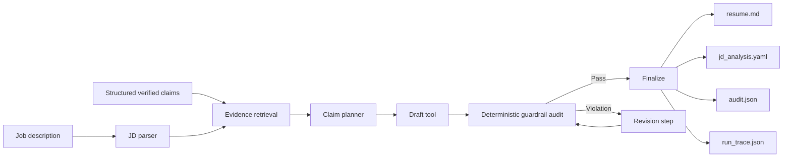

# Evidence-grounded Resume Tailoring Agent

[](https://github.com/JosieCen/Evidence-grounded_Resume_Tailoring_Agent/actions/workflows/ci.yml)

A privacy-safe AI-agent showcase for **tailoring resume content to a job description without inventing experience**.

**v0.2 adds pluggable semantic retrieval** while preserving deterministic factual authorization. The system can run with lexical matching, Sentence Transformers embeddings, or a hybrid retriever. Semantic similarity can propose evidence; it cannot authorize an unsupported claim.

> **Public-showcase boundary:** every person, organization, job description, metric and artifact in this repository is fictional. No private application data or real contact information is included.

## Product question

Generic LLM resume rewriting can improve relevance, but it can also fabricate responsibilities, inflate partial matches, detach numbers from evidence, or hide genuine gaps. A purely lexical matcher has the opposite problem: it can miss transferable experience when the JD and profile use different wording.

> **How can an agent improve semantic recall while preserving claim-level provenance and refusing unsupported claims?**

## Agent workflow



The retrieval layer is replaceable; the evidence contract and final authorization layer are not.

## v0.2 retrieval modes

| Mode | Purpose | Dependency |
| --- | --- | --- |
| `lexical` | Transparent token/synonym baseline | Core package only |
| `embedding` | Semantic similarity for paraphrases and transferable experience | Optional Sentence Transformers |
| `hybrid` | Weighted lexical + semantic retrieval | Optional Sentence Transformers |

The default embedding adapter uses `sentence-transformers/all-MiniLM-L6-v2`. Retrieval outputs expose lexical, semantic, and combined scores so the evidence map remains inspectable.

## Current retrieval benchmark

A six-case fictional benchmark intentionally contains semantic paraphrases, lexical controls, and one unsupported commercial requirement.

| Retriever | Top-1 accuracy | Recall@3 | Gap accuracy |
| --- | ---: | ---: | ---: |
| Lexical | 66.7% | 83.3% | 100% |
| Embedding | **83.3%** | **100%** | **100%** |
| Hybrid | **83.3%** | **100%** | **100%** |

The most illustrative case is:

> `Explain complex technical findings clearly to non-specialist audiences.`

The lexical baseline returns `GAP`; embedding and hybrid retrieval correctly recover `claim_scientific_communication`. The real-model benchmark runs in GitHub Actions and publishes machine-readable artifacts. Aggregate values are committed in [`examples/retrieval_baseline_summary.json`](examples/retrieval_baseline_summary.json).

These results measure retrieval behavior on a small fictional benchmark, **not hiring outcomes**.

## Core design decisions

| Decision | Rationale |
| --- | --- |
| Structured claims as the source of truth | Generated text must not become a new factual database. |
| Claim-level `evidence_refs` | Every visible bullet can be audited back to evidence. |
| `verified`, `visible`, and `do_not_claim` gates | A known fact may still be unsuitable for resume use. |
| GAP stays GAP | Retrieval cannot solve a mismatch by inventing experience. |
| Numeric traceability | Numbers require source-owned metric records. |
| Semantic retrieval ≠ factual authorization | Similarity proposes candidates; deterministic rules authorize them. |
| Explicit run trace | Retrieval and revision decisions remain inspectable. |

## Quick start — lightweight lexical mode

```bash
python -m venv .venv
# Windows: .venv\Scripts\activate
# macOS/Linux: source .venv/bin/activate

pip install -e ".[dev]"

resume-agent run \
  --profile examples/fictional_profile.yaml \
  --jd examples/fictional_jd.md \
  --output outputs/demo \
  --retriever lexical
```

Generated artifacts:

```text
outputs/demo/
├── jd_analysis.yaml   # requirement -> ranked evidence + scores + gaps
├── resume.md          # evidence-authorized output
├── audit.json         # factual-safety result + traceability
└── run_trace.json     # controller/tool decision trace
```

## Semantic / hybrid retrieval

```bash
pip install -e ".[dev,embedding]"

resume-agent run \
  --profile examples/fictional_profile.yaml \
  --jd examples/fictional_jd.md \
  --output outputs/hybrid_demo \
  --retriever hybrid
```

Use `--retriever embedding` for pure embedding retrieval. A custom Sentence Transformers model can be supplied with `--embedding-model`.

## Retrieval benchmark

```bash
resume-agent benchmark-retrieval \
  --profile examples/fictional_profile.yaml \
  --benchmark examples/retrieval_benchmark.yaml \
  --retriever lexical \
  --output outputs/lexical_benchmark.json
```

After installing the embedding extra, rerun with `--retriever embedding` or `--retriever hybrid`. The report includes top-1 accuracy, recall@3, explicit-gap accuracy, selected claim IDs, match level, and retrieval scores.

This deliberately separates **semantic relevance evaluation** from **factual safety evaluation**.

## Guardrail evaluation

```bash
resume-agent evaluate \
  --profile examples/fictional_profile.yaml \
  --output outputs/evaluation.json
```

Current baselines:

- **10 automated tests pass** in lightweight CI;
- **7/7 synthetic factual-safety cases pass**;
- missing/unknown sources are blocked;
- unverified and hidden claims are blocked;
- forbidden wording is blocked;
- untraceable numbers are blocked;
- verified, traceable claims are allowed;
- the E2E demo preserves an unsupported JD requirement as an explicit `GAP`.

The unsafe-draft demo still verifies the audit/revision loop:

```bash
resume-agent run \
  --profile examples/fictional_profile.yaml \
  --jd examples/fictional_jd.md \
  --output outputs/unsafe_demo \
  --simulate-unsafe-draft
```

The injected unsupported production/revenue claim is removed before finalization.

## Streamlit demo

```bash
pip install -e ".[ui]"
streamlit run app.py
```

For embedding/hybrid mode:

```bash
pip install -e ".[ui,embedding]"
streamlit run app.py
```

The UI exposes retriever selection, retrieval scores, requirement-to-evidence mapping, tailored output, and the final audit.

## Repository structure

```text
Evidence-grounded_Resume_Tailoring_Agent/
├── src/evidence_grounded_resume_agent/
│   ├── agent.py                  # controller + audit/revision loop
│   ├── retrieval.py              # lexical / embedding / hybrid retrieval
│   ├── retrieval_evaluation.py   # labeled retrieval benchmark
│   ├── tools.py                  # JD parsing, planning, drafting
│   ├── guardrails.py             # deterministic factual authorization
│   ├── profile.py                # structured evidence model
│   ├── render.py                 # auditable outputs
│   ├── evaluation.py             # factual-safety evaluation
│   └── cli.py
├── examples/
│   ├── fictional_profile.yaml
│   ├── fictional_jd.md
│   ├── retrieval_benchmark.yaml
│   ├── retrieval_baseline_summary.json
│   └── generated_demo/
├── tests/
├── docs/
├── app.py
└── .github/workflows/
    ├── ci.yml
    └── semantic-benchmark.yml
```

## CARR summary

### Context

Resume tailoring has two competing risks: unconstrained generation can fabricate relevance, while lexical matching can miss semantically equivalent experience.

### Action

I separated semantic retrieval from factual authorization. v0.2 introduces lexical, embedding, and hybrid retrievers with inspectable scores, while verified-source filtering, provenance, metric ownership, forbidden-claim rules, and final audit remain deterministic.

### Results

On the six-case fictional benchmark, embedding/hybrid retrieval improved Top-1 accuracy from **66.7% to 83.3%** and Recall@3 from **83.3% to 100%**, while preserving **100% explicit-gap accuracy**. Lightweight CI passes 10 automated tests, and the factual-safety suite remains 7/7.

### Reflection

Embedding similarity improves recall but does not prove factual equivalence. The next useful iteration is a larger labeled benchmark, threshold calibration, and an optional LLM reranker that can explain semantic equivalence while remaining downstream of the same evidence contract.

Full case study: [`docs/CARR.md`](docs/CARR.md).

## Limitations

This is a portfolio-grade prototype, not a production recruiting platform. The public benchmark is small and fictional. Embedding similarity is not proof that two experiences are equivalent. The system does not rank candidates, infer protected attributes, or claim improvements in offer rate, ATS score, or commercial outcomes.

## Roadmap

- [x] Pluggable lexical / embedding / hybrid retrieval.
- [x] Optional Sentence Transformers adapter.
- [x] Inspectable candidate retrieval scores.
- [x] Labeled requirement-to-claim benchmark command.
- [x] Real embedding/hybrid integration benchmark in GitHub Actions.
- [ ] Expand the semantic benchmark and calibrate retrieval thresholds.
- [ ] Add optional LLM reranking/explanation behind the same evidence contract.
- [ ] Add controlled paraphrasing that preserves source claim IDs.

## License

MIT.
