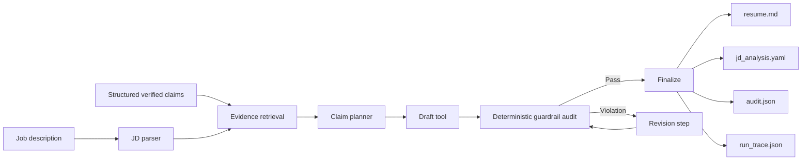

# Evidence-grounded Resume Tailoring Agent

[](https://github.com/JosieCen/Evidence-grounded_Resume_Tailoring_Agent/actions/workflows/ci.yml)

A privacy-safe AI-agent showcase for **tailoring resume content to a job description without inventing experience**.

**v0.2 adds pluggable semantic retrieval** while preserving the original deterministic factual-safety boundary. The system can run with lexical matching, Sentence Transformers embeddings, or a hybrid retriever. Semantic similarity can propose evidence; it can never authorize an unsupported claim.

> **Public-showcase boundary:** every person, organization, job description, metric and artifact in this repository is fictional. No private application data or real contact information is included.

## Product question

Generic LLM resume rewriting can improve relevance, but it can also fabricate responsibilities, inflate partial matches, detach numbers from their evidence, or hide genuine gaps.

This project asks:

> **How can an agent improve role relevance while preserving claim-level provenance and refusing unsupported claims?**

## Agent workflow



The retrieval layer is replaceable; the evidence contract and final authorization layer are not.

## v0.2 retrieval modes

| Mode | Purpose | Dependency |
| --- | --- | --- |
| `lexical` | Transparent token/synonym baseline | Core package only |
| `embedding` | Semantic similarity for paraphrases and transferable experience | Optional Sentence Transformers |
| `hybrid` | Combines lexical evidence with semantic similarity | Optional Sentence Transformers |

The default embedding adapter uses `sentence-transformers/all-MiniLM-L6-v2`. Retrieval outputs expose lexical, semantic, and combined scores so the evidence map remains inspectable.

## Core design decisions

| Decision | Rationale |
| --- | --- |
| Structured claims as the source of truth | Generated text must not become a new factual database. |
| Claim-level `evidence_refs` | Every visible bullet can be audited back to evidence. |
| `verified`, `visible`, and `do_not_claim` gates | A known fact may still be unsuitable for resume use. |
| GAP stays GAP | Retrieval cannot solve a mismatch by inventing experience. |
| Numeric traceability | Numbers require source-owned metric records. |
| Semantic retrieval ≠ factual authorization | Similarity proposes candidates; deterministic rules authorize them. |
| Explicit run trace | Retrieval and revision decisions remain inspectable. |

## Quick start — lightweight lexical mode

```bash
python -m venv .venv
# Windows: .venv\Scripts\activate
# macOS/Linux: source .venv/bin/activate

pip install -e ".[dev]"

resume-agent run \
  --profile examples/fictional_profile.yaml \
  --jd examples/fictional_jd.md \
  --output outputs/demo \
  --retriever lexical
```

Generated artifacts:

```text
outputs/demo/
├── jd_analysis.yaml   # requirement -> ranked evidence + scores + gaps
├── resume.md          # evidence-authorized output
├── audit.json         # factual-safety result + traceability
└── run_trace.json     # controller/tool decision trace
```

## Semantic / hybrid retrieval

Install the optional embedding dependency:

```bash
pip install -e ".[dev,embedding]"
```

Run hybrid retrieval:

```bash
resume-agent run \
  --profile examples/fictional_profile.yaml \
  --jd examples/fictional_jd.md \
  --output outputs/hybrid_demo \
  --retriever hybrid
```

Or pure embedding retrieval:

```bash
resume-agent run \
  --profile examples/fictional_profile.yaml \
  --jd examples/fictional_jd.md \
  --output outputs/embedding_demo \
  --retriever embedding
```

A custom Sentence Transformers model can be supplied with `--embedding-model`.

## Retrieval benchmark

v0.2 adds a fictional labeled benchmark with semantic paraphrases, lexical controls, and an explicit unsupported requirement.

```bash
resume-agent benchmark-retrieval \
  --profile examples/fictional_profile.yaml \
  --benchmark examples/retrieval_benchmark.yaml \
  --retriever lexical \
  --output outputs/lexical_benchmark.json
```

After installing the embedding extra, rerun with `--retriever embedding` or `--retriever hybrid` and compare:

- top-1 accuracy;
- recall@3;
- explicit-gap accuracy;
- per-case selected claim IDs and retrieval scores.

This separates **semantic relevance evaluation** from the existing **factual safety evaluation**.

## Guardrail evaluation

```bash
resume-agent evaluate \
  --profile examples/fictional_profile.yaml \
  --output outputs/evaluation.json
```

Committed baseline on the fictional fixture:

- **7/7 synthetic guardrail cases passed**;
- missing or unknown sources are blocked;
- unverified and hidden claims are blocked;
- forbidden wording is blocked;
- untraceable numbers are blocked;
- verified, traceable claims are allowed;
- the E2E demo preserves an unsupported JD requirement as an explicit `GAP`.

The unsafe-draft demo still verifies the audit/revision loop:

```bash
resume-agent run \
  --profile examples/fictional_profile.yaml \
  --jd examples/fictional_jd.md \
  --output outputs/unsafe_demo \
  --simulate-unsafe-draft
```

The injected unsupported production/revenue claim is removed before finalization.

## Streamlit demo

```bash
pip install -e ".[ui]"
streamlit run app.py
```

For embedding/hybrid mode:

```bash
pip install -e ".[ui,embedding]"
streamlit run app.py
```

The UI exposes retriever selection, top retrieval scores, requirement-to-evidence mapping, tailored output, and the final audit.

## Repository structure

```text
Evidence-grounded_Resume_Tailoring_Agent/
├── src/evidence_grounded_resume_agent/
│   ├── agent.py                  # controller + audit/revision loop
│   ├── retrieval.py              # lexical / embedding / hybrid retrieval
│   ├── retrieval_evaluation.py   # labeled semantic retrieval benchmark
│   ├── tools.py                  # JD parsing, planning, drafting
│   ├── guardrails.py             # deterministic factual authorization
│   ├── profile.py                # structured evidence model
│   ├── render.py                 # auditable outputs
│   ├── evaluation.py             # factual-safety evaluation
│   └── cli.py
├── examples/
│   ├── fictional_profile.yaml
│   ├── fictional_jd.md
│   ├── retrieval_benchmark.yaml
│   └── generated_demo/
├── tests/
├── docs/
├── app.py
└── .github/workflows/ci.yml
```

## CARR summary

### Context

Resume tailoring with generative AI creates a trust problem: stronger role-specific wording is useful, but lexical matching misses paraphrases while unconstrained generation can fabricate relevance.

### Action

I separated semantic retrieval from factual authorization. v0.2 introduces pluggable lexical, embedding, and hybrid retrievers with inspectable similarity scores, while verified-source filtering, provenance, metric ownership, forbidden-claim rules, and the final audit remain deterministic.

### Results

The project now supports both lightweight offline execution and optional semantic retrieval, provides a labeled retrieval benchmark, records candidate-level retrieval scores, preserves explicit gaps, and retains the original guardrail/revision evaluation and CI.

### Reflection

Embedding similarity improves recall but does not establish factual equivalence. The next useful iteration is not to weaken thresholds; it is to benchmark retrieval on more labeled examples, calibrate thresholds, and optionally add an LLM reranker that can explain semantic equivalence while remaining downstream of the same evidence contract.

Full case study: [`docs/CARR.md`](docs/CARR.md).

## Limitations

This is a portfolio-grade prototype, not a production recruiting platform. Embedding similarity is not proof that two experiences are equivalent. The public benchmark is small and fictional. The system does not rank candidates, infer protected attributes, or claim improvements in offer rate, ATS score, or commercial outcomes.

## Roadmap

- [x] Pluggable lexical / embedding / hybrid retrieval.
- [x] Optional Sentence Transformers adapter.
- [x] Inspectable candidate retrieval scores.
- [x] Labeled requirement-to-claim benchmark command.
- [ ] Run and publish a larger semantic benchmark with a real embedding model.
- [ ] Add optional LLM reranking/explanation behind the same evidence contract.
- [ ] Add calibrated relevance thresholds and retrieval error analysis.
- [ ] Add controlled paraphrasing that preserves source claim IDs.

## License

MIT.
