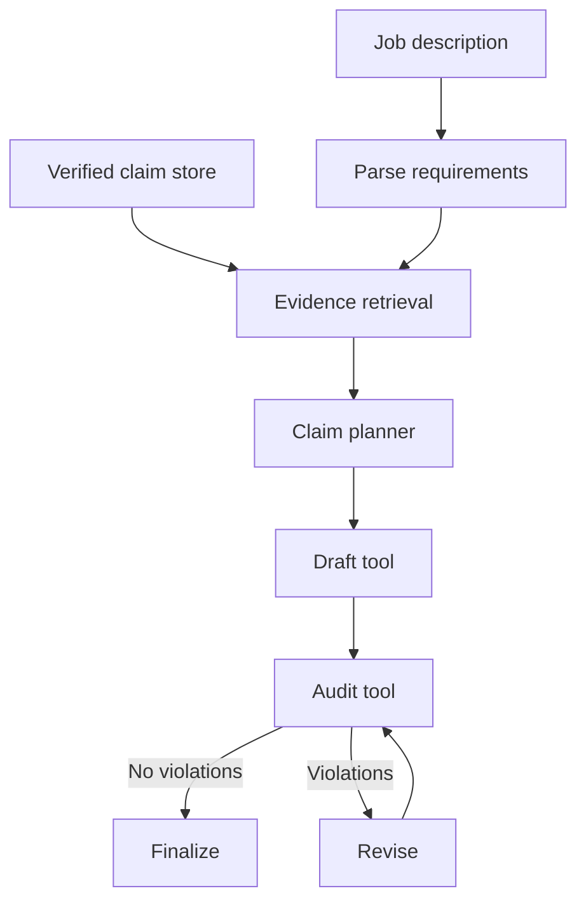

# Architecture

## Separation of concerns

The main architectural choice is to separate **semantic relevance** from **factual authorization**.



### Reasoning/relevance layer

- parses a JD into atomic requirements;
- finds evidence that may support each requirement;
- labels the result as `STRONG_MATCH`, `PARTIAL_MATCH`, or `GAP`;
- chooses a small set of claims for the tailored output.

The current implementation uses transparent token/synonym matching so it can run offline and remain inspectable.

### Evidence contract

A claim carries:

- stable claim ID;
- text;
- `evidence_refs`;
- verification state;
- visibility state;
- optional `do_not_claim` phrases;
- optional metric IDs and values;
- semantic tags.

The draft is not itself a fact source.

### Guardrail layer

The audit checks:

- missing source IDs;
- unknown source IDs;
- unverified claims;
- hidden/private claims;
- missing evidence references;
- forbidden wording;
- numbers without a source-owned metric;
- duplicate bullets.

If a draft bullet fails, the agent removes that bullet and re-runs the audit before finalization.

## Why not let the LLM self-check?

A model can be useful for semantic matching and rewriting, but asking the same probabilistic model to both create and authorize a factual claim collapses two different responsibilities. This project therefore keeps factual authorization deterministic and inspectable.

## Replaceable reasoning layer

A future LLM or embedding retriever should implement the same input/output contract:

```text
Requirement -> ranked claim IDs + match level + rationale
```

That lets semantic quality improve without weakening provenance and guardrail rules.
