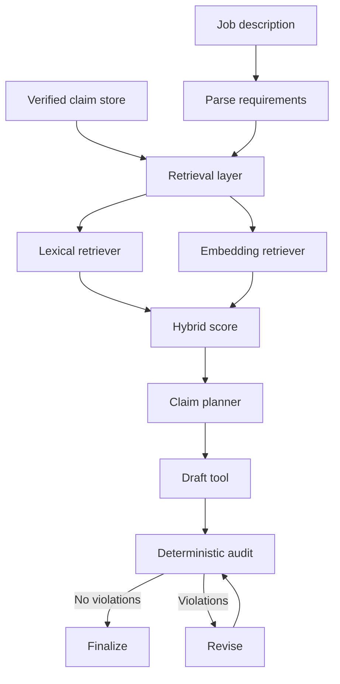

# Architecture

## Separation of concerns

The main architectural choice is to separate **semantic relevance** from **factual authorization**.



## Retrieval layer

v0.2 provides three interchangeable modes:

- `lexical`: token/synonym overlap; transparent and dependency-light;
- `embedding`: cosine similarity over Sentence Transformers embeddings;
- `hybrid`: weighted lexical + semantic score.

Every selected candidate records:

- claim ID;
- lexical score;
- semantic score;
- combined score;
- lexical overlap tokens.

This keeps semantic retrieval inspectable instead of returning an unexplained match.

The default embedding adapter is `sentence-transformers/all-MiniLM-L6-v2`, but the adapter implements a small `TextEmbedder` contract so another embedding provider can be substituted later.

## Evidence contract

A claim carries:

- stable claim ID;
- text;
- `evidence_refs`;
- verification state;
- visibility state;
- optional `do_not_claim` phrases;
- optional metric IDs and values;
- semantic tags.

Only claims that are verified, visible, and backed by evidence are offered to the retrieval layer. The draft is never treated as a new fact source.

## Why semantic similarity does not authorize a claim

Embedding similarity can recover paraphrases and transferable experience, but a high cosine score does not prove that two responsibilities are factually equivalent. The system therefore treats retrieval as **candidate generation**, not authorization.

The deterministic audit still checks:

- missing source IDs;
- unknown source IDs;
- unverified claims;
- hidden/private claims;
- missing evidence references;
- forbidden wording;
- numbers without a source-owned metric;
- duplicate bullets.

If a draft bullet fails, the agent removes it and re-runs the audit before finalization.

## Hybrid scoring

The default hybrid configuration combines:

```text
combined_score = 0.35 * lexical_score + 0.65 * semantic_score
```

The weights and thresholds are explicit configuration rather than hidden prompt behavior. They are intentionally provisional and should be calibrated against the labeled retrieval benchmark rather than assumed to be universally optimal.

## Replaceable reasoning layer

Future LLM reranking can sit after retrieval:

```text
Requirement
  -> lexical/embedding candidate retrieval
  -> optional LLM rerank + rationale
  -> claim planner
  -> deterministic factual authorization
```

The LLM would be allowed to improve ordering and explain semantic equivalence, but it would not be allowed to create evidence or bypass claim-level provenance.
